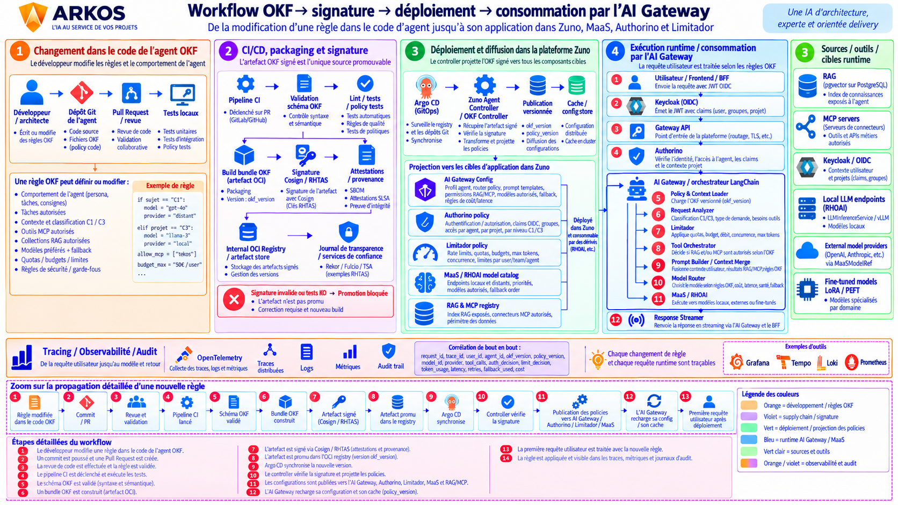

# OKF Workflow: Change, Sign, Deploy, Consume

This page walks through the full lifecycle of an OKF rule — from a developer editing an agent's declarative definition to that rule being applied to a live user request by the AI Gateway. It complements [Agent Request Workflow](request-workflow.md) (which covers only the runtime/consumption leg) with the supply-chain and deployment legs upstream of it.

The diagram shows the platform's **target end-to-end shape**. Two of its five stages are live on the platform today; the other two are the OKF stream's still-`Proposed` decisions. Each section below says which is which.

## 1. Change in the agent's OKF code — live today

A developer/architect edits an agent's rules directly under `agents/<name>/` in this repository (persona, authorized tasks, authorized MCP tools, RAG collections, preferred/fallback model, quotas, security rules). The change goes through a normal PR: code review, unit/integration tests, policy lint.

## 2. CI/CD, packaging and signing — live today

- CI builds an OKF bundle (an OCI artifact) from `agents/<name>/`, versioned as `okf_version`.
- The bundle is signed keyless with Cosign via **Red Hat Trusted Artifact Signer** (RHTAS — [ADR-0535](../adr/0535-adopt-rhtas-as-the-artifact-trust-and-supply-chain-service.md), Implemented 2026-09-02), which replaced the earlier in-cluster Vault Transit signer ([ADR-0420](../adr/0420-sign-supply-chain-artifacts-in-cluster-with-vault-transit.md), superseded). Fulcio issues the signing identity, Rekor/Trillian record the transparency-log entry.
- [ADR-0106](../adr/0106-enforce-okf-bundle-signing-and-validation.md) (Implemented) enforces the fail-closed contract: Agent Runtime's registry refuses to load a bundle whose signature, OKF schema or declared-tool/knowledge references don't validate. `ZUNO_REQUIRE_SIGNED_BUNDLES` has been `true` in production since 2026-08-22, re-verified live for all 8 agents on 2026-08-25.
- A signature or test failure blocks promotion — the artifact is never published, and a corrected build is required.

## 3. Deployment and diffusion across the platform — target state (Proposed)

The diagram's ArgoCD/"Zuno Agent Controller" leg — a controller watching the OKF registry and the `zuno-okf` Git repository, projecting signed policies live into the AI Gateway, Authorino, Limitador and the MaaS/RAG registry without an image rebuild — is the **OKF v0.2/v0.3 target**, not current behavior:

- [ADR-0506](../adr/0506-extract-okf-content-into-a-standalone-zuno-okf-repository.md) (extract OKF content into a standalone `zuno-okf` repo), [ADR-0507](../adr/0507-consume-the-zuno-okf-repository-through-a-single-pinned-reference.md) (single pinned ref) and [ADR-0508](../adr/0508-isolate-okf-parsing-behind-per-component-adaptation-hooks.md) (per-component adaptation hooks) are all **Proposed**, retargeted to platform v0.10.
- [ADR-0509](../adr/0509-deliver-okf-content-as-mounted-versioned-artifacts.md) (operator-materialized mounted artifacts, replacing baked-image content) and [ADR-0510](../adr/0510-make-the-aiagent-operator-watch-the-zuno-okf-repository.md) (AIAgent operator watch loop on `zuno-okf`, live reconciliation within CR-declared ceilings) are also **Proposed**, same v0.10 target.

**What actually happens today:** signed OKF content stays baked into each component's container image at build time, built from this repository (not yet a separate `zuno-okf` repo), and reaches running agents through a normal image rebuild + Day 1 Ansible rollout — not a live ArgoCD-driven policy projection. See the [OKF roadmap](../roadmap/okf-roadmap.md) for the full milestone/WP tracker (WP-48 through WP-53 cover this gap).

## 4. Runtime execution / consumption by the AI Gateway — live today

This leg is real and is the same pipeline documented in [Agent Request Workflow](request-workflow.md):

1. User/frontend/BFF sends the request with the OIDC JWT.
2. Keycloak issued that JWT with the user's claims (identity, groups, project).
3. The Gateway API is the platform's single entry point (routing, TLS).
4. Authorino verifies identity and authorizes against the agent's claims/project context.
5. The AI Gateway's Policy & Context Loader loads the signed OKF (by `okf_version`).
6. Request Analyzer classifies the request (C1/C3, intent, tools needed).
7. Limitador applies quota/budget/rate-limit policy.
8. Tool Orchestrator decides which RAG collections / MCP servers are authorized under this OKF.
9. Prompt Builder / Context Merge fuses OKF instructions with RAG/MCP results.
10. Model Router picks a model per sub-request (cost/latency/health, preferred + fallback).
11. MaaS/RHOAI executes the call against a local, remote or fine-tuned (LoRA/PEFT) endpoint.
12. The Response Streamer returns the answer.

## Tracing and observability

Every step emits OpenTelemetry traces/logs/metrics correlated end to end by `request_id`/`trace_id`, plus supply-chain-specific attributes the diagram calls out: `okf_version`, `policy_version`, `model_id`, `auth_decision`, `limit_decision`, `fallback_used`. Example backends: Grafana, Tempo, Loki, Prometheus.

## Related ADRs

- [ADR-0106](../adr/0106-enforce-okf-bundle-signing-and-validation.md) — OKF bundle signing and validation (Implemented)
- [ADR-0535](../adr/0535-adopt-rhtas-as-the-artifact-trust-and-supply-chain-service.md) — RHTAS as the artifact trust/supply-chain service (Implemented)
- [ADR-0506](../adr/0506-extract-okf-content-into-a-standalone-zuno-okf-repository.md) / [0507](../adr/0507-consume-the-zuno-okf-repository-through-a-single-pinned-reference.md) / [0508](../adr/0508-isolate-okf-parsing-behind-per-component-adaptation-hooks.md) — OKF extraction (Proposed, v0.10)
- [ADR-0509](../adr/0509-deliver-okf-content-as-mounted-versioned-artifacts.md) / [0510](../adr/0510-make-the-aiagent-operator-watch-the-zuno-okf-repository.md) — live reconciliation (Proposed, v0.10)
- [OKF roadmap](../roadmap/okf-roadmap.md) — milestones and work-package tracker
