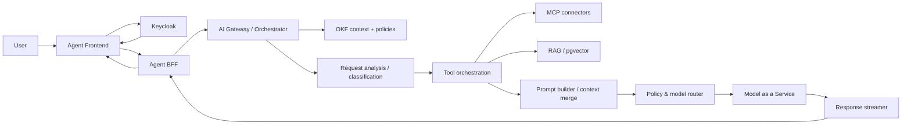
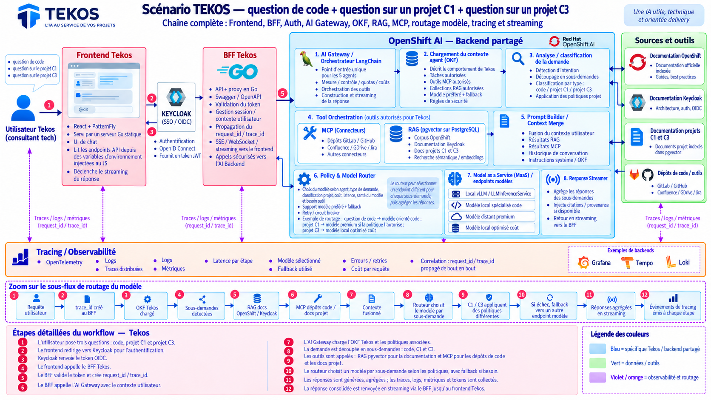
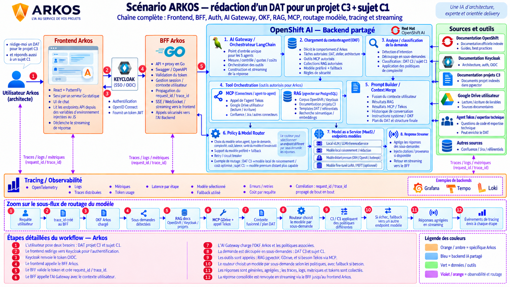
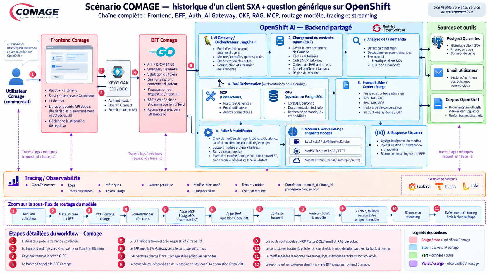

# Agent Request Workflow

This page explains how a user request travels through the platform to reach an agent and come back as an answer. It complements the per-agent pages ([Tekos](tekos.md), [Arkos](arkos.md), [Comage](comage.md)) and the abstract sequence diagrams in [`../architecture/sequence-flows.md`](../architecture/sequence-flows.md) with full, scenario-based diagrams for three of the five cataloged agents.

## Shared pipeline

Every agent reuses the same platform building blocks; only the OKF definition, the authorized tools/RAG collections and the model routing policy change per agent.

**Front path (per agent):**

1. **Frontend** (React + PatternFly) - chat UI, served as a static app, reads its API endpoints from injected environment variables, and drives the response streaming.
2. **Keycloak** (SSO / OIDC) - authenticates the user and issues the OIDC token.
3. **BFF** (Go) - validates the token, manages the session/user context, creates the `request_id` / `trace_id` pair, propagates it downstream, and relays the streamed response (SSE/WebSocket) back to the frontend.

**Shared backend on OpenShift AI:**

1. **AI Gateway / LangChain orchestrator** - single entry point for all agents; enforces quotas and cost control; orchestrates tool calls; builds and streams the final response.
2. **Agent context loading (OKF)** - loads the agent's declarative definition: authorized tasks, authorized MCP tools, authorized RAG collections, preferred model plus fallback, and security rules.
3. **Request analysis / classification** - detects intent, splits the request into sub-requests when needed, and applies the relevant complexity/security policies.
4. **Tool orchestration** - calls the tools the agent is authorized to use: MCP connectors (other agents, external systems) and RAG search (pgvector on PostgreSQL).
5. **Prompt builder / context merge** - merges the user context, RAG results, MCP results, conversation history and system instructions (OKF) into the prompt and response plan.
6. **Policy & model router** - selects a model per sub-request based on the agent, request type, complexity, cost and model health; supports a preferred model with fallback, retry and circuit breaking; can route different sub-requests to different model endpoints.
7. **Model as a Service (MaaS)** - the selected endpoint: a local model (vLLM / `LLMInferenceService`), a fine-tuned LoRA/PEFT model, or a remote premium model (OVH, OpenAI, Anthropic, ...).
8. **Response streamer** - aggregates the sub-answers, injects citations/provenance when available, and streams the result back to the BFF.

**Tracing and observability:** every step emits OpenTelemetry traces, logs, metrics, per-step latency, the selected model and whether a fallback was used, errors/retries and cost, all correlated end-to-end by the propagated `request_id` / `trace_id` (example backends: Grafana, Tempo, Loki).

## Tekos - code question + questions on two projects

Scenario: a consultant asks Tekos a code question plus a question on project C1 and a question on project C3, in a single message.

1. The user asks three questions: a code question, one on project C1, one on project C3.
2. The frontend redirects to Keycloak for authentication.
3. Keycloak returns the OIDC token.
4. The frontend calls the Tekos BFF.
5. The BFF validates the token and creates the `request_id` / `trace_id`.
6. The BFF calls the AI Gateway with the user context.
7. The AI Gateway loads the Tekos OKF and its associated policies.
8. The request is split into sub-requests: code, project C1, project C3.
9. Tools are called: RAG pgvector for documentation, and MCP for the code repositories and project docs.
10. The router selects a model per sub-request, with fallback if needed.
11. Answers are generated and aggregated; traces, logs, metrics and token usage are collected.
12. The consolidated answer is streamed back through the BFF to the Tekos frontend.

## Arkos - Technical Design Document (DAT) + project question

Scenario: an architect asks Arkos to draft a DAT (Dossier/Document d'Architecture Technique) for project C3 while also asking a question on topic C1.

1. The user has two requests: a DAT for project C3 and a question on topic C1.
2. The frontend redirects to Keycloak for authentication.
3. Keycloak returns the OIDC token.
4. The frontend calls the Arkos BFF.
5. The BFF validates the token and creates the `request_id` / `trace_id`.
6. The BFF calls the AI Gateway with the user context.
7. The AI Gateway loads the Arkos OKF and its associated policies.
8. The request is split into sub-requests: DAT for C3 and question on C1.
9. Tools are called: RAG pgvector, Google Drive, and the Tekos agent via MCP when technical expertise is needed.
10. The router selects a model per sub-request, with fallback if needed.
11. Answers are generated and aggregated; traces, logs, metrics and token usage are collected.
12. The consolidated answer (the DAT plus the C1 answer) is streamed back through the BFF to the Arkos frontend.

## Comage - sales history + generic platform question

Scenario: a salesperson asks Comage for the sales history of an SXA client together with a generic question about OpenShift.

1. The user submits the combined request.
2. The frontend redirects to Keycloak for authentication.
3. Keycloak returns the OIDC token.
4. The frontend calls the Comage BFF.
5. The BFF validates the token and creates the `request_id` / `trace_id`.
6. The BFF calls the AI Gateway with the user context.
7. The AI Gateway loads the Comage OKF and its associated policies.
8. The request is split into two needs: SXA sales history and the OpenShift question.
9. Tools are called: MCP for PostgreSQL sales data and user email, and RAG pgvector for the OpenShift corpus.
10. The context is merged and the router selects the appropriate model, with fallback if needed.
11. The model generates the answer; traces, logs, metrics and token usage are collected.
12. The answer is streamed back through the BFF to the Comage frontend.

## Takeaways for using an agent correctly

- Always go through the agent's own frontend/BFF pair - agents do not share a login session or an API surface, only the backend platform.
- A single message can carry several needs at once (e.g. a document to draft and an unrelated question); the platform splits it into sub-requests and may route each to a different model.
- What an agent can answer or act on is bounded by its OKF: authorized tasks, authorized MCP tools and authorized RAG collections. A question outside that scope will not be answered even if the underlying model could technically do it.
- Every response can fall back to another model endpoint automatically; this is expected behavior for resilience, not an error, and is visible in the traces (`request_id` / `trace_id`).
