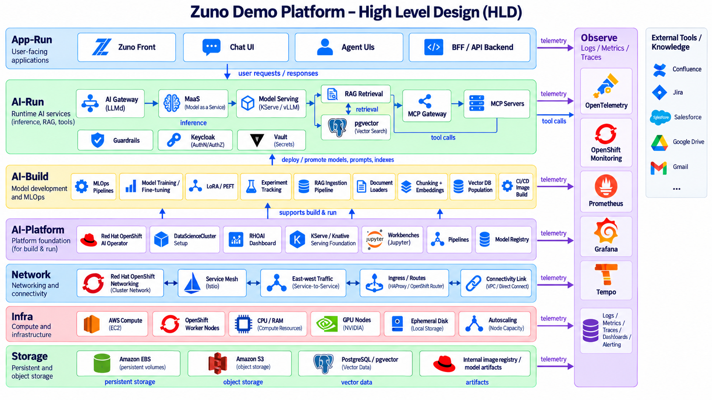
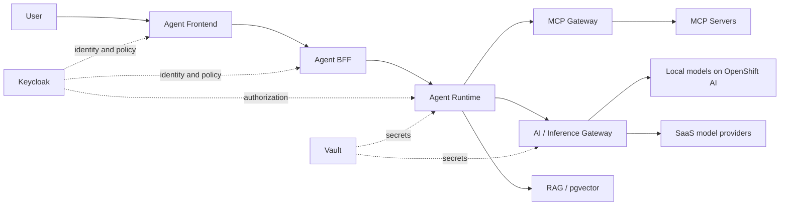

# Architecture Documentation

The high-level design above spans the full stack, from user-facing apps down to storage: App-Run (frontends/BFFs), AI-Run (gateway, MaaS, model serving, RAG, MCP), AI-Build (MLOps/RAG ingestion pipelines), the AI-Platform foundation (OpenShift AI), Network, Infra and Storage, plus the Observe stack and external SaaS tools each layer integrates with. Each detailed view below drills into one slice of this picture; low-level component diagrams (`docs/assets/img/zuno-lld-*.png`) go one level deeper still and are referenced from their respective docs.

The architecture documentation is intentionally split into complementary views.

- `functional-architecture.md` - users, agents, tasks, and business capabilities.
- `logical-architecture.md` - reusable platform services and responsibilities.
- `physical-architecture.md` - OpenShift deployment boundaries and namespaces.
- `security-architecture.md` - identity, policy, secrets, network, and data classification.
- `data-architecture.md` - business data, vector data, memory, and document context.
- `ai-architecture.md` - OpenShift AI, model serving, RAG, evaluation, and inference governance.
- `identity-architecture.md` - Keycloak, Google federation, delegated OAuth, and identity propagation.
- `network-architecture.md` - routes, service paths, NetworkPolicies, and controlled egress.
- `sequence-flows.md` - representative runtime sequences.

## Baseline logical flow

