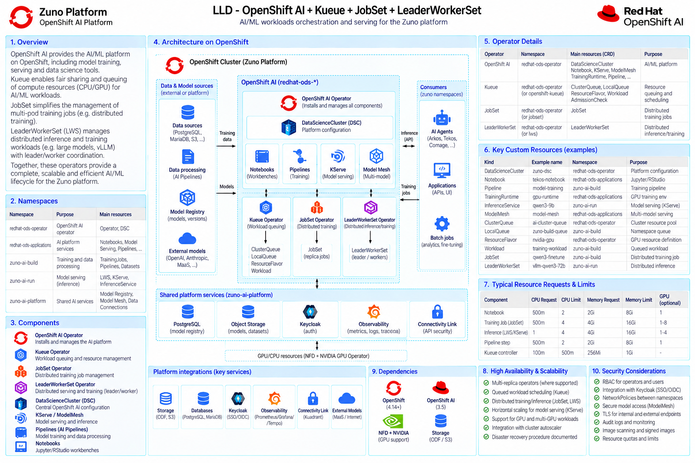
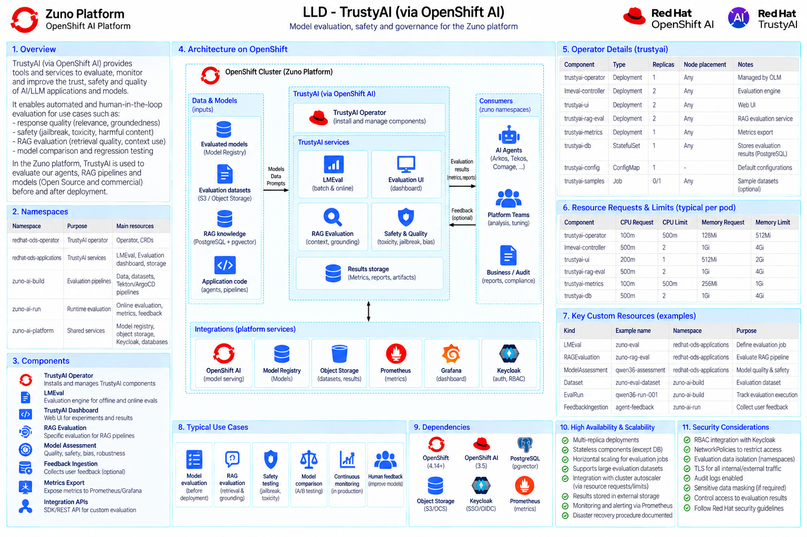
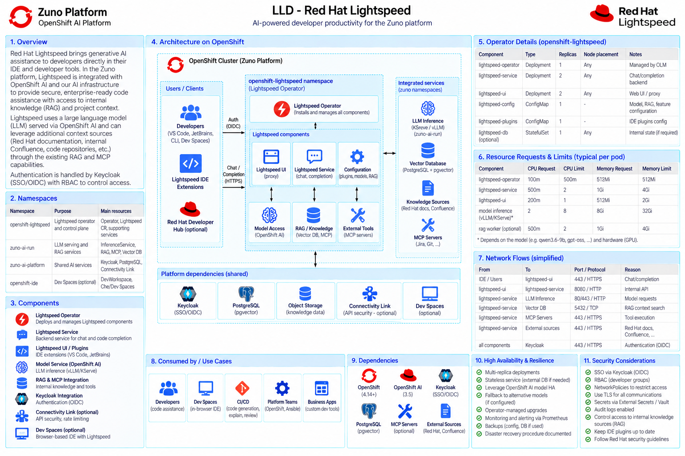

# AI Architecture

The AI architecture uses Red Hat OpenShift AI 3.5 as the primary AI platform. The design intentionally separates agent orchestration from inference governance.

- **Agent Runtime**: state, LangChain/LangGraph workflows, RAG, MCP and task orchestration.
- **AI/Inference Gateway**: model selection, local/SaaS routing, classification enforcement, quotas, costs, fallback and streaming.
- **OpenShift AI model serving**: five local models on MIG slices of an RTX PRO 6000 96 GB (ADR-0351), not whole cards. Four chat models, each with a declared architectural role in `platform/ai-gateway/provider-routing.yaml`'s `role` key - `qwen3.5-9b` (fleet-wide default, ADR-0531), `qwen3.6-27b-instruct` (higher-quality tier, and the only one serving LoRA adapters, ADR-0518), `gpt-oss-20b` (local reasoning, ADR-0414) and `qwen3.5-9b-wesh` (French urban-register fine-tune for Comage, ADR-0526) - plus `qwen3-embedding-0.6b` for RAG. No Granite or Llama variant is served.
- **KServe / Models-as-a-Service / llm-d**: used where they map to the selected OpenShift AI 3.5 deployment path and maturity constraints.
- **OGX**: the OpenShift AI OGX Operator (ADR-0322), activated in the `DataScienceCluster` (v0) with an OGX-backed RAG provider planned behind Zuno's retrieval contract (v0.1), while retaining explicit application-runtime boundaries.
- **Model Registry / Pipelines / LM-Eval / guardrails**: included as architecture capabilities and activated according to MVP feasibility and component maturity.

SaaS provider default preference/fallback order is OpenAI, Gemini, Anthropic and Mistral, subject to C1/C2/C3 data policy.

OpenShift AI's `DataScienceCluster` provides notebooks, pipelines, KServe/ModelMesh serving and the Model Registry; Kueue queues and fair-shares GPU/CPU workloads, JobSet drives distributed training jobs, and LeaderWorkerSet coordinates distributed multi-pod inference/training (e.g. vLLM).

TrustyAI (via OpenShift AI) runs LM-Eval batch/online evaluation, RAG-specific evaluation (retrieval and groundedness) and safety/quality checks (jailbreak, toxicity, bias) against agents, RAG pipelines and models, before and after deployment (ADR-0534).

Red Hat Lightspeed (ADR-0524) brings generative developer assistance (IDE chat/completion) to platform teams, served by the same local OpenShift AI model backend and able to draw on the platform's RAG/knowledge sources and MCP tools.
