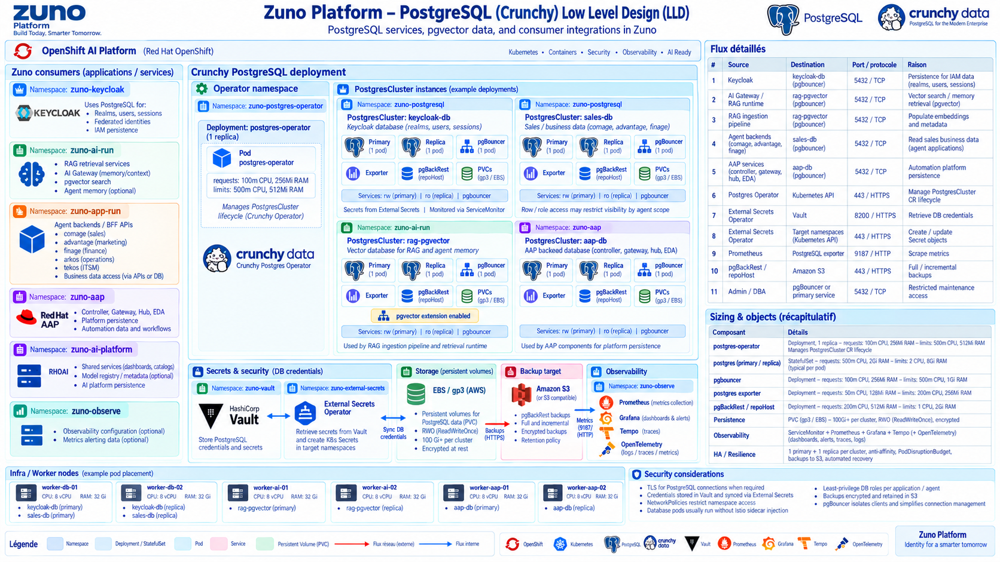
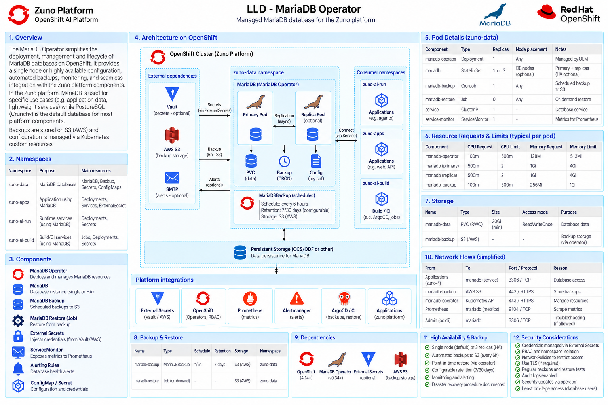

# Data Architecture

Two major data domains are deliberately separated:

1. business/transactional data;
2. knowledge/vector data using PostgreSQL with pgvector and full-text search.

SXA is the company's commercial record from before 2021. ADR-0219 settled how it is served: as a read-only historical RAG corpus (`knowledge.sxa-legacy`), parsed straight from an S3 mysqldump into pgvector. There is no live SXA database in this platform and no structured-query path to one - the MySQL 5.0-era `affaire -> devis -> commande -> facture` chain and its line-item economics survive as the *shape of the corpus*, not as a schema this platform migrates to or operates.

Private Google Drive documents are vectorized only when useful for long-lived work context. Internal and public RAG corpora remain logically separated.

Both domains are served by a single PostgreSQL cluster (PGO-managed, 1 primary + 2 async replicas with Patroni failover) fronted by PgBouncer transaction pooling. TimescaleDB and pgvector extensions are preloaded on the same cluster. Backups land on a local PVC by default, with S3 backup wired but disabled by default (`docs/platform/prerequisites.md`).

Separate `PostgresCluster` instances (each with its own primary/replica/PgBouncer/backup set) isolate concerns per consumer: Keycloak's realm/session store, sales/business data for the Comage/Advantage/Finage agents, the `rag-pgvector` cluster backing RAG retrieval and agent memory, and AAP's own persistence.

A second, separate MariaDB instance (MariaDB Operator, in `zuno-data`) holds metadata that doesn't belong in the business/vector PostgreSQL domain: Kubeflow Pipelines/RAG-ingestion pipeline metadata, the mlops DSPA database, RHTAS's Trillian transparency log, and the legacy SXA structured import (ADR-0216).

