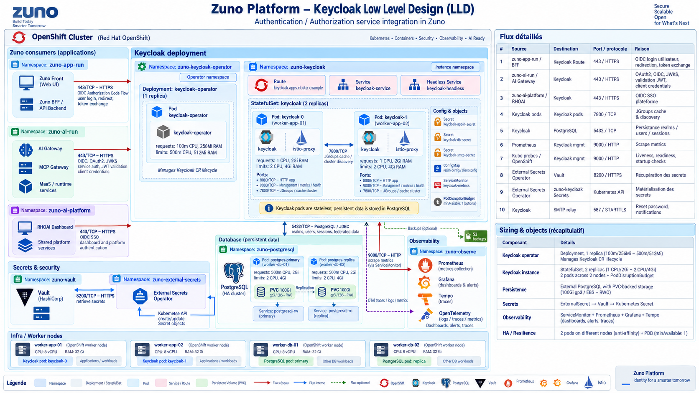

# Identity Architecture

Keycloak is the central identity provider. Google Workspace is federated with Keycloak. Agent access uses groups such as `agent_comage` and `agent_tekos`; privileged sales access uses `sales_admin`.

End-user identity is propagated through BFF and runtime boundaries. Google Workspace tools use delegated OAuth2 user authorization so source ACLs remain effective.

Keycloak runs as a 2-replica StatefulSet in `zuno-keycloak` (HA, cluster-mode JGroups discovery), fronted by `zuno-auth`'s Route and consumed over OIDC/OAuth2 by every frontend/BFF, the AI Gateway and the RHOAI dashboard. It is stateless: realms, users and sessions persist in PostgreSQL, and credentials/SMTP secrets are synced from Vault via the External Secrets Operator (see [security-architecture.md](security-architecture.md)).
