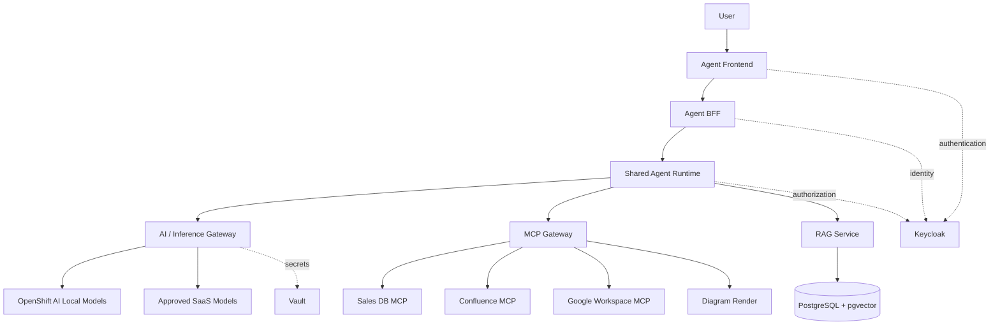
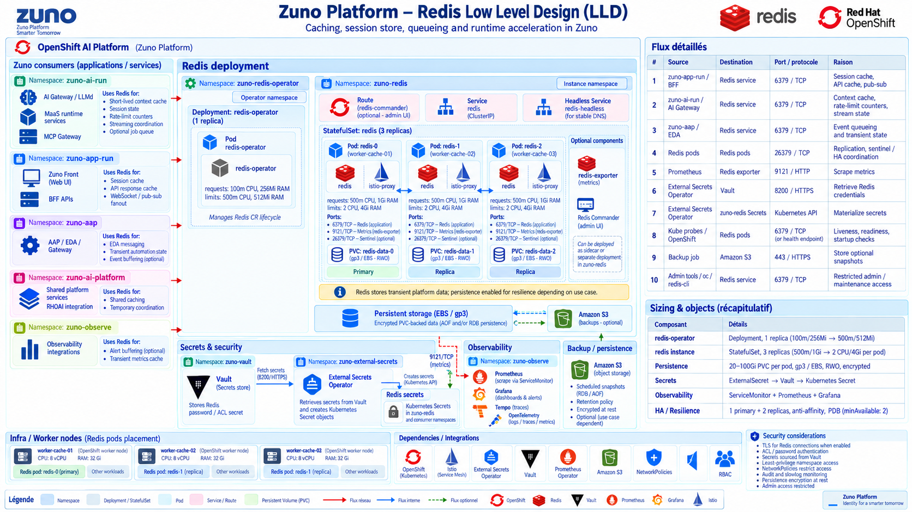

# Logical Architecture

Dedicated frontends/BFFs are instantiated per agent; runtime, AI gateway and MCP gateway are shared platform services. The PostgreSQL + pgvector target is an HA cluster (see `docs/architecture/data-architecture.md`), not a single instance.

A single shared Redis instance (in `zuno-auth`) serves two distinct roles: the server-side opaque session/token store behind the BFFs (ADR-0042), and the AI Gateway's controlled semantic response cache (ADR-0104).
