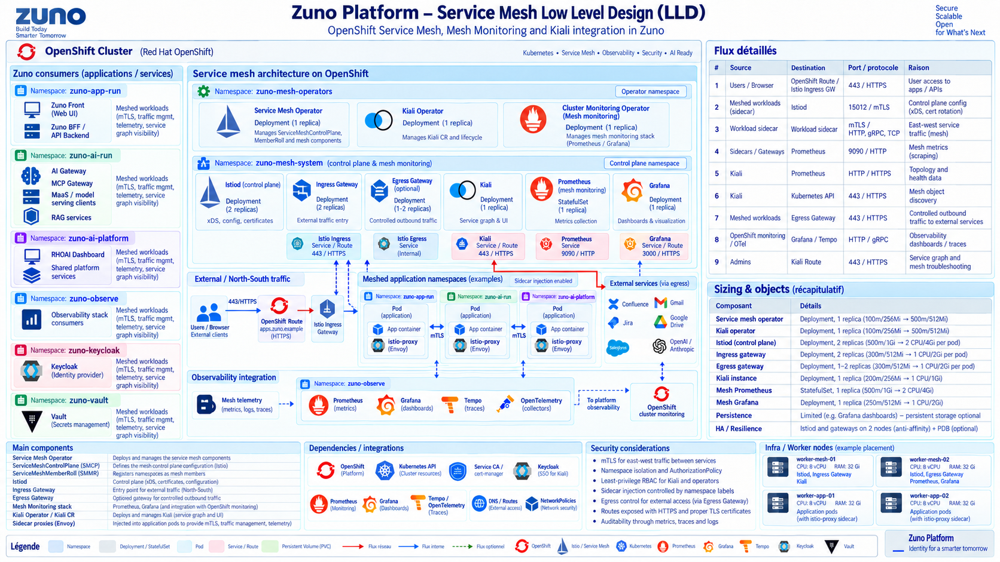
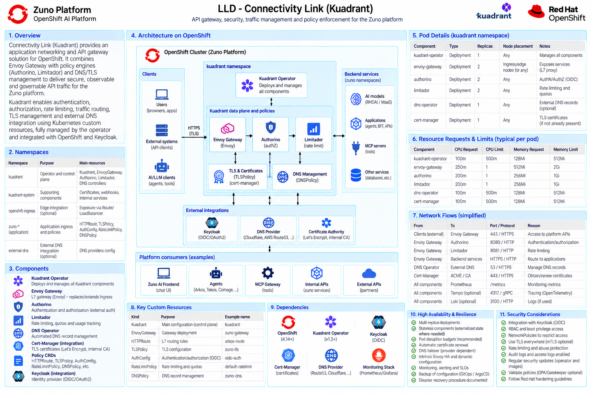

# Network Architecture

The cluster is internet-connected. Namespace-level NetworkPolicies isolate agents and restrict access to shared runtime, AI gateway, MCP gateway, identity, data and approved external endpoints. Direct access from agent namespaces to undeclared MCP servers or data services is denied by default.

A service mesh (Istio, deployed via the Sail Operator/`servicemeshoperator3` OLM package, control plane in `zuno-mesh`) adds a second, workload-identity-based isolation layer on top of NetworkPolicies: mesh-wide mTLS between sidecar-injected workloads (`zuno-ai-run`, `zuno-ai-build`), with mesh certificates issued by a Vault-backed `ClusterIssuer` via `cert-manager-istio-csr`. NetworkPolicies remain the coarse-grained, always-on boundary; the mesh adds encrypted, mutually authenticated transport and per-workload identity for traffic that crosses it.

Kiali and mesh-scoped Prometheus/Grafana/Tempo (in `zuno-observe`) give service-graph visibility and telemetry for meshed traffic, on top of the ingress/egress gateways that carry north-south traffic in and out of the mesh.

Kuadrant Connectivity Link (Envoy Gateway + Authorino + Limitador + DNS/TLS policy CRDs) was installed as a Day 0 prerequisite operator (ADR-0317) to provide a future Gateway-API-fronted layer for authentication, rate limiting and quota enforcement in front of inference traffic (ADR-0511). It is not yet wired to any live Gateway/AuthPolicy/RateLimitPolicy in this MVP.

