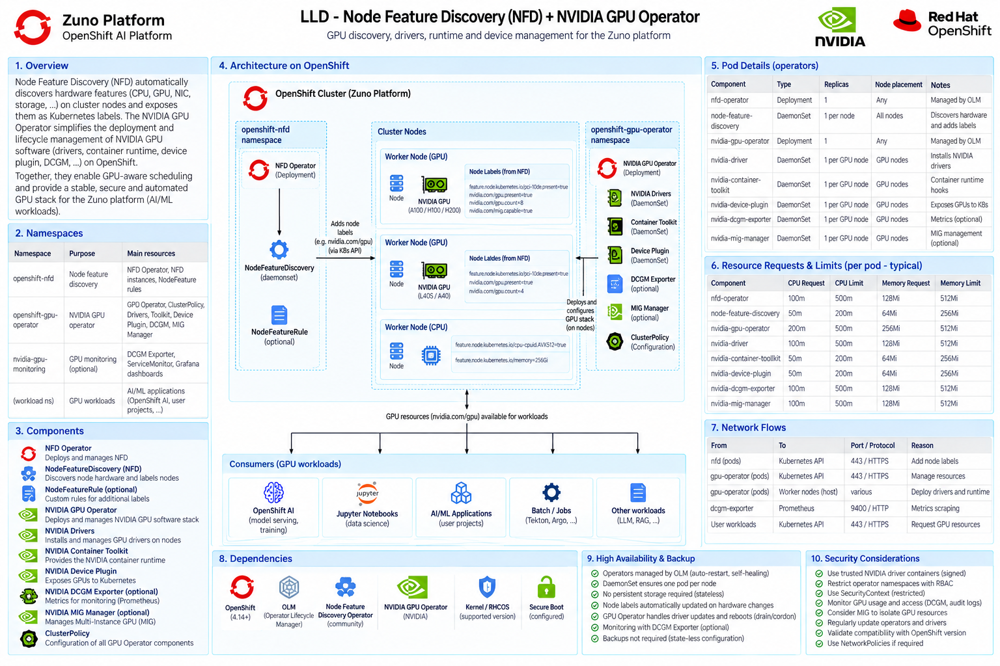
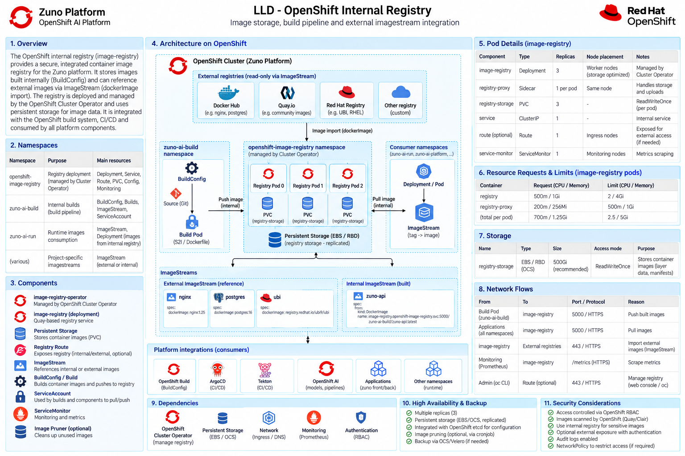
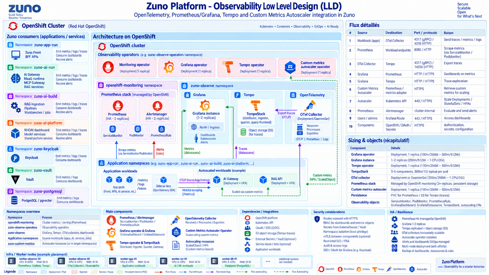
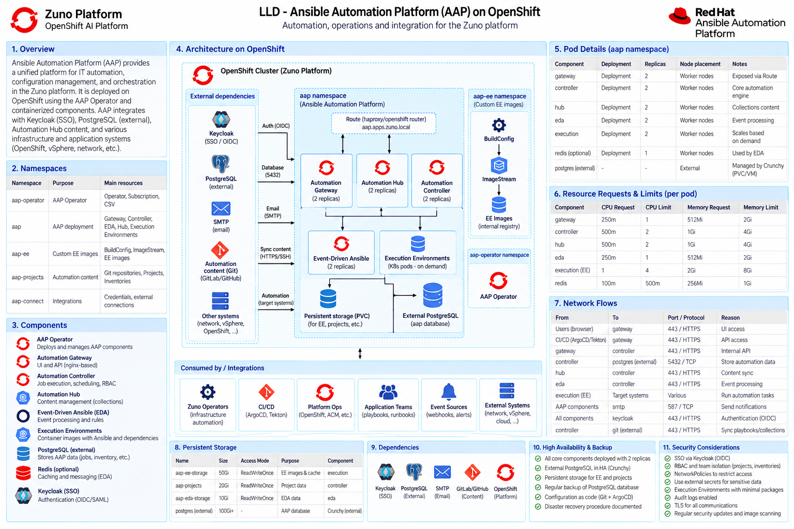

# Physical Architecture

The MVP targets OpenShift 4.22 on AWS IPI. Namespace layout:

- `zuno-ai-run` — every active agent's frontend/BFF (only `tekos` in v0)
  plus Agent Runtime, AI Gateway, MCP Gateway.
- `zuno-ai-build` — in-cluster image builds via `BuildConfig`/
  `ImageStream`, isolated from running workloads.
- `redhat-ods-applications` — RHOAI's own control-plane operands (KServe,
  the OGX Operator, AI Gateway); `rhoai-model-registries` — Model
  Registry. A prior custom shared-platform namespace (`zuno-ai-platform`)
  was tried, found unused and removed (ADR-0333, ADR-0548) — see docs/adr/
  for why.
- `zuno-auth` (Keycloak), `zuno-vault` (Vault, External Secrets
  Operator), `zuno-data` (PostgreSQL, MariaDB), `zuno-monitoring` (observability),
  `zuno-mesh` (Istio control plane), `zuno-aap` (Ansible Automation
  Platform) — one dedicated namespace per platform service.

Istio sidecar injection is enabled on `zuno-ai-run`
and `zuno-ai-build` for mesh-wide mTLS. OpenShift AI manages local model
serving on GPU workers. PostgreSQL, Keycloak, Vault, cert-manager,
External Secrets Operator, the service mesh and observability are
explicit Day 0 prerequisites (`make day0|d0 install`).

Detailed node sizing and resource requests are refined during implementation and captured in `docs/platform/configuration.md` and the `gitops/charts/*/values.yaml` deployment manifests.

## GPU workers

NFD labels each node's hardware (CPU, NIC, and per-GPU model/count/MIG-capability); the NVIDIA GPU Operator then installs drivers, the container runtime toolkit, device plugin and (optionally) MIG manager on labelled GPU nodes, exposing `nvidia.com/gpu` resources that OpenShift AI schedules model-serving and training workloads onto (ADR-0351).

## Internal image registry

`BuildConfig`s in `zuno-ai-build` push built images to OpenShift's internal `image-registry`; `ImageStream`s reference both those internally-built images and read-only imports from external registries (Docker Hub, Quay, Red Hat Registry), and are pulled cross-namespace into `zuno-ai-run` and other consumer namespaces.

## Observability

Prometheus/Alertmanager (managed by OpenShift monitoring), plus a Grafana and Tempo operator stack and an OpenTelemetry Collector in `zuno-observe`, collect metrics, logs and traces from every namespace and drive dashboards, alerting and (via the custom metrics autoscaler) HPA/KEDA-style scaling.

## Operational automation

Ansible Automation Platform, in `zuno-aap`, wraps the Day 0-3 `ansible/playbooks/day{0,1,2,3}_*.yml` operations as Automation Controller Job Templates with SSO (Keycloak), centralized execution history and RBAC-gated launch (ADR-0354, ADR-0418), backed by its own PostgreSQL database and optional Redis for Event-Driven Ansible.
