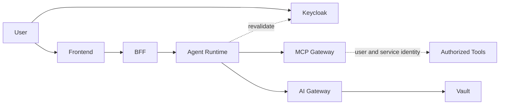

# Security Architecture

Security is based on explicit identity propagation, least privilege and policy intersection.

Effective authorization combines:

`agent definition ∩ user/group rights ∩ task rights ∩ data classification ∩ platform policy`.

C3 content never leaves local inference. C2 content may use external models only after the relevant context restrictions are satisfied.
