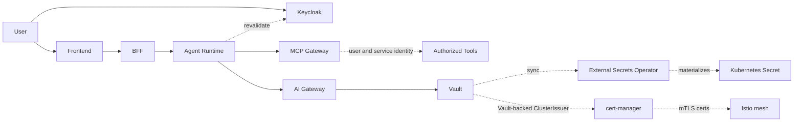
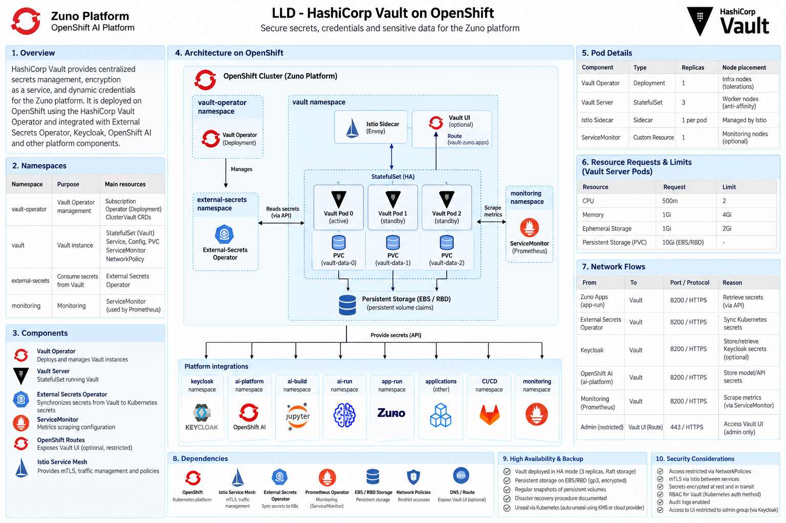
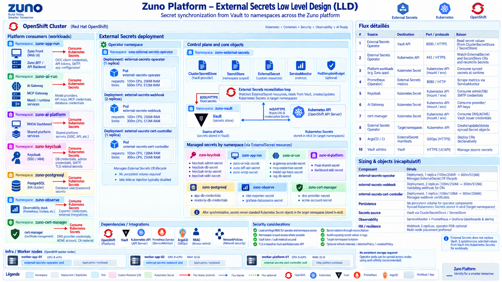
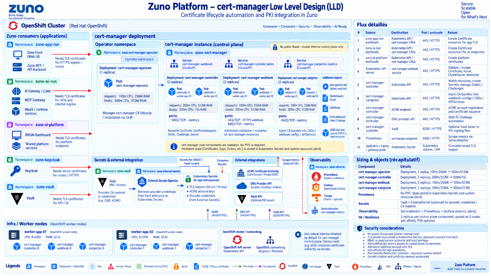
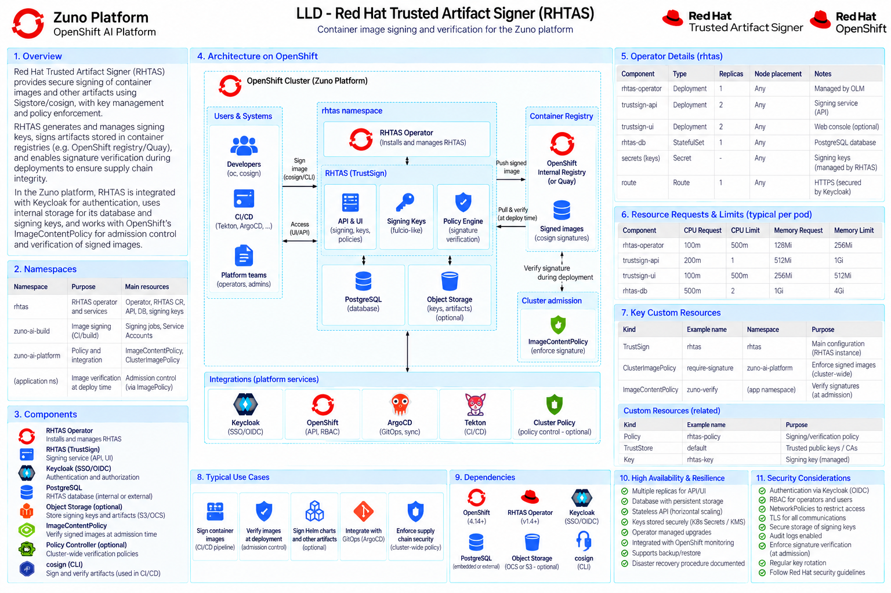

# Security Architecture

Security is based on explicit identity propagation, least privilege and policy intersection.

Effective authorization combines:

`agent definition ∩ user/group rights ∩ task rights ∩ data classification ∩ platform policy`.

C3 content never leaves local inference. C2 content may use external models only after the relevant context restrictions are satisfied.

Vault is never accessed directly by workloads: the External Secrets Operator syncs Vault-held values into Kubernetes `Secret` objects, and cert-manager issues workload/mesh mTLS certificates from a Vault-backed `ClusterIssuer` (consumed by the Istio service mesh for mutual authentication between meshed workloads).

## Secrets and PKI

Vault runs as a 3-replica HA StatefulSet (Raft storage) in `zuno-vault` and is the sole source of truth for secrets, credentials and PKI material; it is never reached directly by application workloads.

The External Secrets Operator reconciles `ExternalSecret`/`SecretStore` custom resources into namespace-scoped Kubernetes `Secret` objects, one reconciliation loop per consuming namespace (`zuno-app-run`, `zuno-ai-run`, `zuno-keycloak`, `zuno-postgresql`, `zuno-observe`, `zuno-cert-manager`, ...).

cert-manager issues and rotates TLS certificates for routes and mesh workloads from ACME and Vault-backed `ClusterIssuer`s; its control plane is stateless, with all issued material held in Kubernetes `Secret`s and `Certificate`/`Order`/`Challenge` custom resources.

## Supply chain trust

Red Hat Trusted Artifact Signer (RHTAS, ADR-0535) provides keyless cosign/Sigstore signing (Fulcio, Rekor, Trillian, TUF) for first-party container images and OKF agent bundles built in `zuno-ai-build`, replacing the earlier Vault Transit signer (ADR-0420). An `ImageContentPolicy` enforces signature verification at admission, and `make d2 check supply-chain` verifies the chain end to end.
