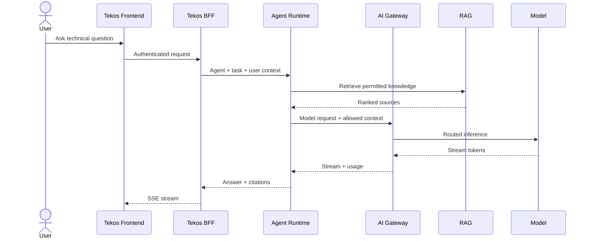
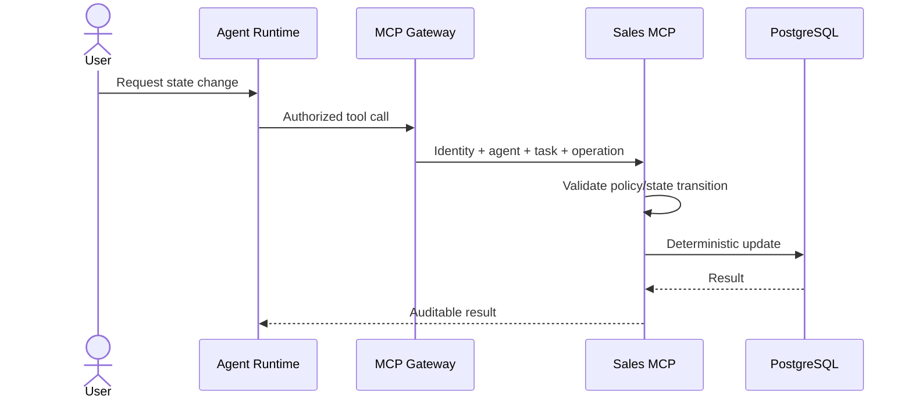

# Sequence Flows

## Tekos RAG request

```mermaid
sequenceDiagram
  actor U as User
  participant F as Tekos Frontend
  participant B as Tekos BFF
  participant R as Agent Runtime
  participant G as AI Gateway
  participant K as RAG
  participant M as Model
  U->>F: Ask technical question
  F->>B: Authenticated request
  B->>R: Agent + task + user context
  R->>K: Retrieve permitted knowledge
  K-->>R: Ranked sources
  R->>G: Model request + allowed context
  G->>M: Routed inference
  M-->>G: Stream tokens
  G-->>R: Stream + usage
  R-->>B: Answer + citations
  B-->>F: SSE stream
```

## Controlled sales write

```mermaid
sequenceDiagram
  actor U as User
  participant R as Agent Runtime
  participant M as MCP Gateway
  participant S as Sales MCP
  participant D as PostgreSQL
  U->>R: Request state change
  R->>M: Authorized tool call
  M->>S: Identity + agent + task + operation
  S->>S: Validate policy/state transition
  S->>D: Deterministic update
  D-->>S: Result
  S-->>R: Auditable result
```
