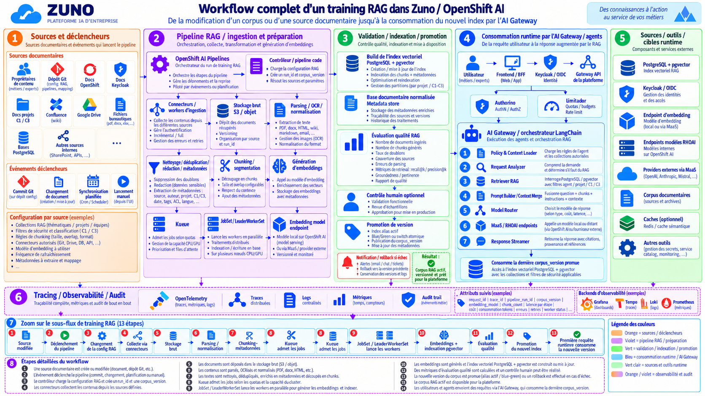

# RAG Data Flow: Training/Ingestion Workflow

Source -> acquire -> normalize -> classify -> chunk -> embed locally when required -> index -> retrieve -> authorize/filter -> rank -> cite -> answer.

This page expands that one-line flow into the full RAG corpus training/ingestion pipeline, from a source change to the AI Gateway consuming the refreshed index.

The diagram shows the platform's **target end-to-end shape**. The sections below say which parts run in production today and which are conceptual/future extensions of the same pipeline.

## 1. Sources and triggers — live today

Documentary sources: Red Hat product documentation and persona-scoped Confluence spaces ([ADR-0330](../adr/0330-integrate-the-rag-ingestion-pipeline-as-a-day1-component.md)). Triggers: a scheduled KFP recurring run (cron); a manual pipeline run is also possible. Per-source configuration (collections, chunking, access-control tagging, embedding model) lives in `gitops/charts/rag-ingestion/values.yaml`.

## 2. RAG ingestion pipeline — live today, with real optimizations

`components/rag-ingestion/src/rag_ingestion.py` runs as an OpenShift AI Pipelines (KFP) job with one stage per pipeline step: fetch → detect-changes (sha256 manifest diff) → normalize (HTML cleanup) → chunk (tiktoken token-aware splitting) → embed → index-pgvector → validate. State round-trips through S3 between stages since each runs in its own pod.

- [ADR-0330](../adr/0330-integrate-the-rag-ingestion-pipeline-as-a-day1-component.md) (Implemented) — the pipeline itself, the dedicated `rag-tech` PostgreSQL database, the `embeddings` InferenceService (BAAI/bge-small-en-v1.5, 384-dim, vLLM/KServe), and Confluence ACL tagging (`document_embeddings.metadata.acl_groups`) enforced at query time by [ADR-0046](../adr/0046-make-rag-retrieval-metadata-aware-and-bilingual.md).
- [ADR-0519](../adr/0519-parallelize-and-shortcut-the-rag-ingestion-fetch-stages.md) (Implemented) — the concrete concurrency mechanism behind the diagram's "parallel ingestion": `ThreadPoolExecutor` fetch concurrency plus conditional-GET (`ETag`/`If-None-Match`) for Red Hat docs, and a checksum short-circuit plus parallel S3 writes for the SXA MariaDB dump. Live-verified 2026-08-25: the SXA fetch stage went from 127+ minutes (incomplete) to 35m27s.

**What the diagram adds beyond current code:** Kueue-admitted `JobSet`/`LeaderWorkerSet` workers distributing embedding generation across multiple GPU nodes. Today's pipeline parallelizes I/O (fetch/write) with thread pools inside single-pod KFP stages — it does not yet distribute embedding computation itself across a Kueue-managed multi-worker job. Kueue/`TrainJob` distributed compute is live elsewhere in the platform for LoRA fine-tuning ([ADR-0538](../adr/0538-adopt-rhoai-35-workload-surfaces-mlflow-kueue-trainingjobs.md), [ADR-0539](../adr/0539-delegate-lora-training-compute-to-a-kfp-submitted-trainjob.md), both Implemented) but has not been applied to RAG embedding generation.

## 3. Validation, indexing and promotion — partially live

- Ingestion writes and updates `document_embeddings` directly (index build/update, chunk metadata) — live.
- A normalized documentary metadata store (source/version/processing history tracking) — live, as ingestion manifest state in S3 plus `document_embeddings` metadata columns.
- RAG quality evaluation (retrieval recall/precision@k, groundedness) exists as a platform capability via TrustyAI/LMEval ([ADR-0534](../adr/0534-integrate-trustyai-for-ai-evaluation-and-guardrails.md), Implemented) rather than as an automated gate wired into this specific ingestion pipeline run.
- **Not yet implemented:** an optional human-in-the-loop approval step, and a blue/green "active corpus alias" promotion model (`corpus_version`, atomic switch, rollback on failure). Today's pipeline writes directly into the live table; there is no alias indirection or staged rollback in `rag-ingestion`'s current code.

## 4. Runtime consumption by the AI Gateway / agents — live today

Same shared pipeline as [Agent Request Workflow](../agents/request-workflow.md): Keycloak issues the OIDC token, the Gateway API/Authorino/Limitador enforce identity and quota, and the AI Gateway's Retriever queries pgvector filtered by agent/project/C1-C3 classification and by the caller's `acl_groups` intersection ([ADR-0046](../adr/0046-make-rag-retrieval-metadata-aware-and-bilingual.md)) before the Prompt Builder merges results into the model call.

## Tracing and observability

OpenTelemetry traces/logs/metrics correlate a run end to end via `request_id`/`trace_id`/`pipeline_run_id`/`corpus_version`, covering ingestion (chunk counts, embedding cost, retries) and runtime retrieval (latency per stage, tokens consumed). Example backends: Grafana, Tempo, Loki, Prometheus.

## Related ADRs

- [ADR-0330](../adr/0330-integrate-the-rag-ingestion-pipeline-as-a-day1-component.md) — RAG ingestion pipeline as a Day 1 component (Implemented)
- [ADR-0519](../adr/0519-parallelize-and-shortcut-the-rag-ingestion-fetch-stages.md) — parallelized/short-circuited fetch stages (Implemented)
- [ADR-0046](../adr/0046-make-rag-retrieval-metadata-aware-and-bilingual.md) — metadata-aware, ACL-filtered retrieval (Implemented)
- [ADR-0204](../adr/0204-generalize-the-rag-platform-to-multiple-isolated-knowledge-domains.md) — multi-domain RAG platform
- [ADR-0538](../adr/0538-adopt-rhoai-35-workload-surfaces-mlflow-kueue-trainingjobs.md) / [ADR-0539](../adr/0539-delegate-lora-training-compute-to-a-kfp-submitted-trainjob.md) — Kueue/TrainJob distributed compute (Implemented for LoRA training, not yet applied to RAG embedding generation)
